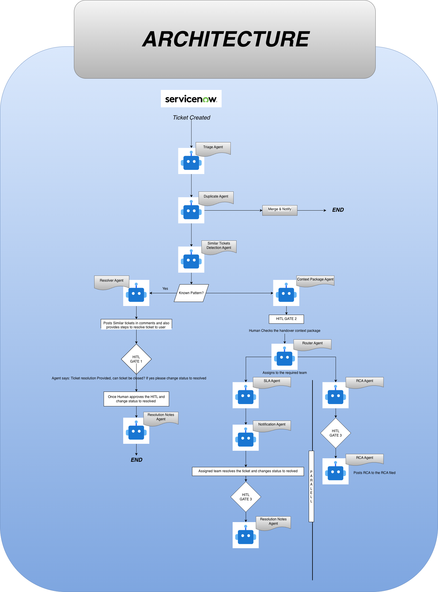

# AgenticNow: Agentic IT Service Management for ServiceNow

> An autonomous multi-agent system that transforms ServiceNow from a passive ticket log into a self-healing IT operations platform — triaging, resolving, escalating, and learning from every incident with minimal human intervention.

---

## Overview

AgenticNow is a agentic AI system built on top of ServiceNow that automates the full IT ticket lifecycle — from intake to root cause analysis. It replaces the repetitive, manual middle layer of L1 IT support with a network of specialised agents that classify, deduplicate, resolve, route, monitor, and learn — while keeping humans in the loop at every consequential decision point.

The system is built around a core principle: **the agent does the work, the human makes the call.** No ticket is closed, routed, published, or changed in production without explicit human confirmation. Every HITL gate is deliberate and purposeful — not a workaround, but a design decision.

---

## Architecture



The system runs two concurrent paths from the moment a ticket is routed:

- **Main path** — handles the individual ticket lifecycle end to end
- **RCA path** — runs in parallel, watching for patterns across all tickets and firing the root cause analysis sub-flow when a clustering threshold is hit

---

## Features

### Manual vs Agentic

| Feature | Manual today | With AgenticNow |
|---|---|---|
| Ticket classification | Agent reads and categorises manually — 4–6 min per ticket | Triage agent classifies type, priority, CI, service in under 3 seconds |
| Duplicate detection | Nobody notices 10 tickets about the same issue | Semantic similarity check on every new ticket, auto-merge on match |
| Known pattern resolution | L1 agent resolves from memory, inconsistent | Resolution Execution agent calls API, verifies fix, suggests close |
| Routing | Dispatcher guesses best team, tickets bounce | Router agent assigns to correct queue with reasoning |
| Context at handoff | Specialist receives raw ticket, rebuilds context from scratch | Full context package pre-built: KB match, similar tickets, CI, SLA window |
| SLA management | Manager checks queue manually, finds breach after it happens | SLA Watchdog monitors burn rate continuously, escalates before breach |
| User updates | User pings helpdesk for status, creates more tickets | Notification agent sends update at every state change automatically |
| Resolution documentation | Agent closes ticket without notes, knowledge lost | Resolution Notes agent drafts summary from Work Notes thread |
| KB maintenance | KB grows stale, nobody adds articles | KB Writer agent auto-publishes new articles when no match exists |
| Root cause analysis | Manual, written as a narrative, tied to nothing | Clustering agent detects patterns, RCA Hypothesis agent generates ranked causes |
| Workaround propagation | Workaround sits in Problem record, never reaches assignees | Workaround agent pushes to all linked open incidents automatically |
| Change Request creation | Raised manually or forgotten entirely | Change Request agent drafts CR with full context, CI, and proposed fix |

---

## Agents Involved

### Intake & Classification
- **Triage agent** — classifies ticket type (incident/request/problem), sets priority P1–P4, identifies affected CI and service
- **Duplicate Detection agent** — runs semantic similarity check against all open tickets; merges duplicates and notifies submitter
- **KB Search agent** — checks incoming ticket against knowledge base for a known resolvable pattern; this is the gate that decides whether a ticket ever reaches a human

### Known Pattern Branch (auto-resolve)
- **Resolution Execution agent** — calls external APIs (Active Directory, Okta, etc.) to execute the fix autonomously
- **Verification agent** — confirms fix worked via API response; on failure, routes ticket to main path as unresolved

### Main Path (escalation)
- **Context Package agent** — assembles the full context package: KB match, top 3 similar past tickets with resolutions, affected CI from CMDB, SLA window, routing recommendation with reasoning
- **Router agent** — assigns ticket to the correct specialist queue (L1/L2/L3, networking, IAM, infra) after L1 lead approval

### Parallel Background Agents
- **SLA Watchdog agent** — monitors burn rate and remaining SLA window for every open ticket; pings assignee, escalates to lead, auto-reassigns as breach approaches
- **Notification agent** — sends proactive status update to ticket submitter at every state change; eliminates inbound status pings

### Post-Resolution Agents (shared across both paths)
- **Resolution Notes agent** — triggered by ticket state changing to Resolved; drafts structured resolution summary from the full Work Notes thread
- **KB Writer agent** — checks if a KB article exists for this resolution pattern; auto-publishes a new article if none exists; no action if article already exists

### RCA Path (parallel, threshold-triggered)
- **Clustering agent** — runs on every routed ticket; detects when N semantically similar tickets sharing a CI or service cross a threshold within a time window
- **Problem Record agent** — auto-creates a Problem record in ServiceNow and links all clustered incidents to it
- **RCA Hypothesis agent** — cross-references CMDB, recent change history, and past resolutions to generate a ranked list of probable root causes with supporting evidence
- **Workaround agent** — after root cause is confirmed, pushes the workaround to the Work Notes of every linked open incident
- **Change Request agent** — drafts a Change Request with pre-filled context: affected CI, full incident history, confirmed root cause, and proposed permanent fix

**Total: 15 agents**

---

## HITL Gates

Five human checkpoints ensure no consequential action happens without sign-off:

| Gate | Trigger | Who acts | Options |
|---|---|---|---|
| **Gate 1** — Auto-resolve close | Verification agent confirms fix | L1 agent | Confirm close / reject (route to main path) |
| **Gate 2** — Routing review | Context package assembled | L1 lead | Approve / edit package / reject back to triage |
| **Gate 3** — Specialist close | Specialist finishes investigation | Specialist | Changes ticket state to Resolved |
| **Gate 4** — RCA confirmation | Hypothesis list generated | Problem coordinator | Picks confirmed root cause from ranked list |
| **Gate 5** — Change approval | CR and KB article drafted | Change Manager | Approves KB publish + CR for production pipeline |

---

## Phases of Development

### Phase 1 — Project Scaffold & ServiceNow Connectivity
**Goal: running skeleton, no agents yet**

- Set up full folder structure for all 7 agents
- Write `MainState` in `main_graph.py` with just `ticket_id`, `is_duplicate`, `is_known_pattern`, `hitl_status`
- Set up `.env`, `requirements.txt`, `langgraph.json`
- Write `servicenow_client.py` with three methods: `get_ticket(ticket_id)`, `patch_ticket(ticket_id, fields)`, `get_work_notes(ticket_id)` — test all three against your PDI
- Write a dummy `main_graph.py` that just passes `ticket_id` through one node and ends — verify it compiles and runs
- Set up SqliteSaver checkpointer

> **Done when:** you can create a ticket in ServiceNow PDI, call `get_ticket()` from Python, and get the data back.

---

### Phase 2 — Triage Agent
**Goal: first real LLM call, sets the pattern for every agent after this**

- `state.py` — `ticket_id`, `raw_description`, `ticket_type`, `priority`, `affected_service`, `ci`, `is_known_pattern`
- `tools.py` — `get_ticket` tool wrapping `servicenow_client`
- `nodes.py` — `fetch_ticket_node`, `classify_node`, `write_classification_node`
- `agent.py` — 3-node linear graph: fetch → classify → write
- Wire into main graph as first node

> **Done when:** ticket created in PDI → triage agent classifies it → classification written to Work Notes in ServiceNow.

---

### Phase 3 — Duplicate Detection Agent
**Goal: first semantic search, establishes embedding pattern**

- `state.py` — `ticket_id`, `raw_description`, `is_duplicate`, `parent_ticket_id`, `similarity_score`
- `tools.py` — `get_open_tickets` tool, `embed_text` tool, `similarity_search` tool
- `nodes.py` — `fetch_ticket_node`, `embed_node`, `search_node`, `decision_node`
- `agent.py` — 4-node graph
- Wire into main graph after triage, add conditional edge: duplicate → END, unique → continue

> **Done when:** two near-identical tickets in PDI → agent detects duplicate, merges, posts in Work Notes, flow ends there.

---

### Phase 4 — Context Package Agent
**Goal: assembles everything a human needs before they see the ticket**

Similar ticket detection lives here as a tool, not a separate agent.

- `state.py` — `ticket_id`, `classification`, `priority`, `similar_tickets`, `kb_match`, `sla_window`, `routing_suggestion`, `context_package`
- `tools.py` — `similar_tickets_search` tool (semantic over resolved tickets), `kb_search` tool, `sla_calculator` tool
- `nodes.py` — `fetch_classification_node`, `similar_tickets_node`, `kb_search_node`, `assemble_package_node`, `write_package_node`
- `agent.py` — 5-node linear graph
- Wire into main graph after duplicate check on the "no duplicate" branch

> **Done when:** ticket flows through triage + dedup + context package → Work Notes contains a clean context package with similar tickets, KB match, and SLA window.

---

### Phase 5 — Router Agent + HITL Gate 2
**Goal: first LangGraph interrupt, most important technical milestone**

- `state.py` — `ticket_id`, `context_package`, `assigned_team`, `routing_reasoning`, `hitl_status`
- `tools.py` — `get_assignment_groups` tool, `assign_ticket` tool
- `nodes.py` — `routing_decision_node`, `hitl_gate_node` (uses `interrupt()`), `apply_routing_node`, `re_triage_node`
- `agent.py` — graph with interrupt at `hitl_gate_node`
- Wire into main graph after context package

> **Done when:** graph pauses at HITL, you can approve/reject via LangGraph Studio or API, approve routes ticket in PDI, reject loops back to triage correctly.

---

### Phase 6 — Resolver Agent + HITL Gate 1
**Goal: known pattern branch, mock execution, second interrupt**

- `state.py` — `ticket_id`, `is_known_pattern`, `resolution_steps`, `verification_status`, `close_suggestion`
- `tools.py` — `kb_pattern_match` tool, `mock_execute_fix` tool, `mock_verify_fix` tool, `set_pending_closure` tool
- `nodes.py` — `pattern_check_node`, `execute_fix_node`, `verify_fix_node`, `suggest_close_node`, `hitl_close_confirm_node` (interrupt)
- `agent.py` — graph with fork: pattern found → execute → verify → HITL, no pattern → exit to main path
- Wire into main graph: triage `is_known_pattern: true` → resolver, `false` → duplicate

> **Done when:** "password reset" ticket → agent detects pattern → mock fix executed → Work Notes says "ready to close" → graph pauses → L1 confirms → ticket moves to Pending Closure in PDI.

---

### Phase 7 — Resolution Notes Agent + HITL Gate 3
**Goal: shared agent reused by both resolver path and main path, triggered by Resolved state**

- `state.py` — `ticket_id`, `work_notes_thread`, `resolution_summary`, `notes_approved`
- `tools.py` — `get_work_notes` tool, `write_resolution_notes` tool
- `nodes.py` — `fetch_notes_node`, `draft_summary_node`, `hitl_approval_node` (interrupt), `write_notes_node`
- `agent.py` — 4-node graph with one interrupt
- Wire into main graph: called after specialist resolves (Resolved state) AND after resolver agent HITL confirms close — same subgraph invoked from both branches

> **Done when:** resolve any ticket manually in PDI → agent drafts resolution summary → graph pauses → you approve → summary saved to ticket resolution notes field.

---

### Phase 8 — RCA Agent + HITL Gate 4
**Goal: parallel branch, most complex agent, build last when you have real ticket data**

- `state.py` — `ticket_id`, `ticket_cluster`, `problem_record_id`, `rca_hypotheses`, `confirmed_root_cause`, `workaround`, `linked_incident_ids`
- `tools.py` — `cluster_scan` tool, `create_problem_record` tool, `get_linked_incidents` tool, `get_change_history` tool, `push_workaround` tool
- `nodes.py` — `cluster_scan_node`, `threshold_check_node`, `create_problem_record_node`, `generate_hypotheses_node`, `hitl_rca_confirm_node` (interrupt), `push_workaround_node`
- `agent.py` — graph with interrupt at RCA confirmation
- Wire into main graph as parallel branch using LangGraph `Send` API, fires independently of individual ticket resolution

> **Done when:** 5 similar tickets in PDI → clustering fires → Problem record created with all incidents linked → hypotheses generated → HITL pauses → coordinator confirms → workaround pushed to all linked incidents.

---

### Phase 9 — Main Graph Assembly & End-to-End Test
**Goal: single entrypoint, full flow working**

- Complete `main_graph.py` wiring all 7 agents as subgraphs
- Add all conditional edges and routing logic
- Add parallel RCA branch using LangGraph `Send`
- Full end-to-end test across all three paths:
  - **Main path:** ticket → triage → dedup → context package → router HITL → specialist resolves → resolution notes HITL → done
  - **Known pattern path:** password reset ticket → resolver → HITL close confirm → resolution notes → done
  - **RCA path:** 5 similar tickets → clustering fires → RCA HITL → workaround pushed → done

> **Done when:** all three paths work end to end without manual intervention except at the designated HITL gates.

---

## Project Structure

```
agenticnow/
├── arch.png
├── README.md
├── .env
├── requirements.txt
├── langgraph.json
├── my_agent/
│   ├── __init__.py
│   ├── main_graph.py
│   ├── triage_agent/
│   │   ├── __init__.py
│   │   ├── agent.py
│   │   └── utils/
│   │       ├── __init__.py
│   │       ├── state.py
│   │       ├── nodes.py
│   │       └── tools.py
│   ├── duplicate_agent/
│   │   ├── __init__.py
│   │   ├── agent.py
│   │   └── utils/
│   │       ├── __init__.py
│   │       ├── state.py
│   │       ├── nodes.py
│   │       └── tools.py
│   ├── context_package_agent/
│   │   ├── __init__.py
│   │   ├── agent.py
│   │   └── utils/
│   │       ├── __init__.py
│   │       ├── state.py
│   │       ├── nodes.py
│   │       └── tools.py
│   ├── router_agent/
│   │   ├── __init__.py
│   │   ├── agent.py
│   │   └── utils/
│   │       ├── __init__.py
│   │       ├── state.py
│   │       ├── nodes.py
│   │       └── tools.py
│   ├── resolver_agent/
│   │   ├── __init__.py
│   │   ├── agent.py
│   │   └── utils/
│   │       ├── __init__.py
│   │       ├── state.py
│   │       ├── nodes.py
│   │       └── tools.py
│   ├── resolution_notes_agent/
│   │   ├── __init__.py
│   │   ├── agent.py
│   │   └── utils/
│   │       ├── __init__.py
│   │       ├── state.py
│   │       ├── nodes.py
│   │       └── tools.py
│   └── rca_agent/
│       ├── __init__.py
│       ├── agent.py
│       └── utils/
│           ├── __init__.py
│           ├── state.py
│           ├── nodes.py
│           └── tools.py
└── integrations/
    └── servicenow_client.py
```

---

## Tech Stack

| Layer | Technology |
|---|---|
| Agent orchestration | LangGraph (StateGraph, multi-agent subgraphs) |
| LLM | GPT-4o / Claude (via API) |
| Platform | ServiceNow PDI (Personal Developer Instance) |
| Backend | FastAPI |
| Vector search | pgvector / Supabase |
| Memory & state | LangGraph checkpointer (SqliteSaver) |
| Notifications | ServiceNow webhooks + email |
| External integrations | Active Directory / Okta APIs (mocked for demo) |